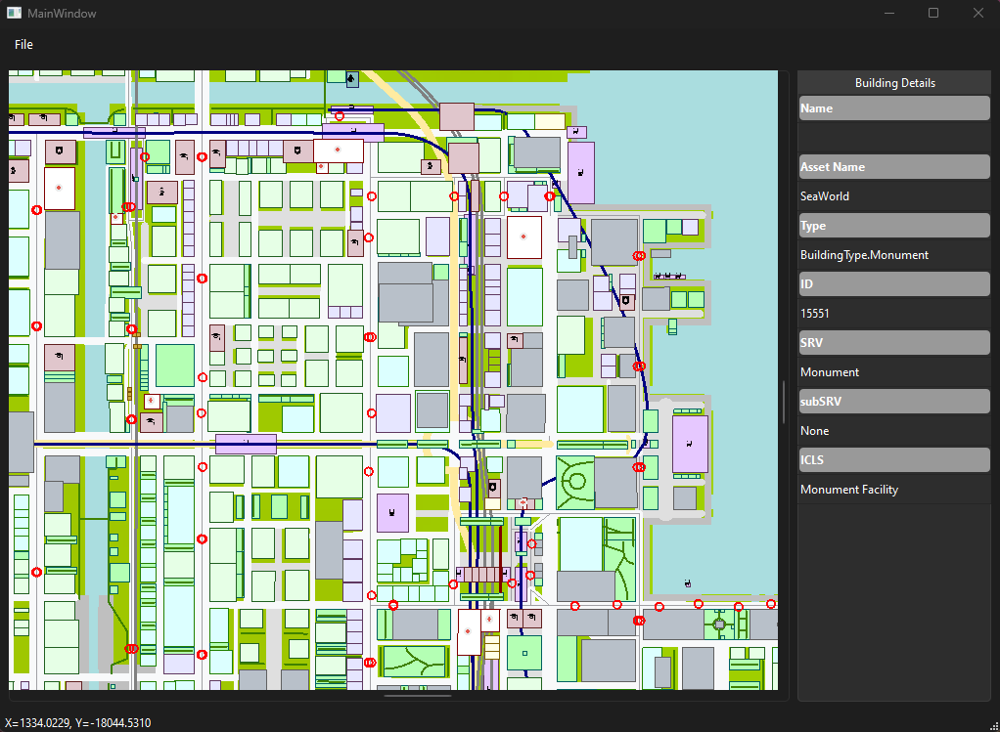

# CSL QMapViewer
 

This Project is intended to continue this Cities:Skyline Mod: https://steamcommunity.com/sharedfiles/filedetails/?id=845665815 \
The `*.clsmap` generation should be handled by the original Mod, this program only draw map using this file.

## Difference to the original viewer
- Fully opensource, so if I die, someone can take over if they want to.
- Build with Python and Qt, should have very good portibility for different OSes
- Vector graphic (for most items)
- Much more responsive
- (Future) Interactive map

# How to run
- Clone this project:
```
git clone https://github.com/KevinUTAT/CSL-QMapViewer.git
```
- Install required packags for Python (Also need Python 3.8+)
```
pip install -r requirements.txt
```
- Run `main_window.py` and point it to the *.clsmap file
```
python main_window.py <path_to_cslmap>